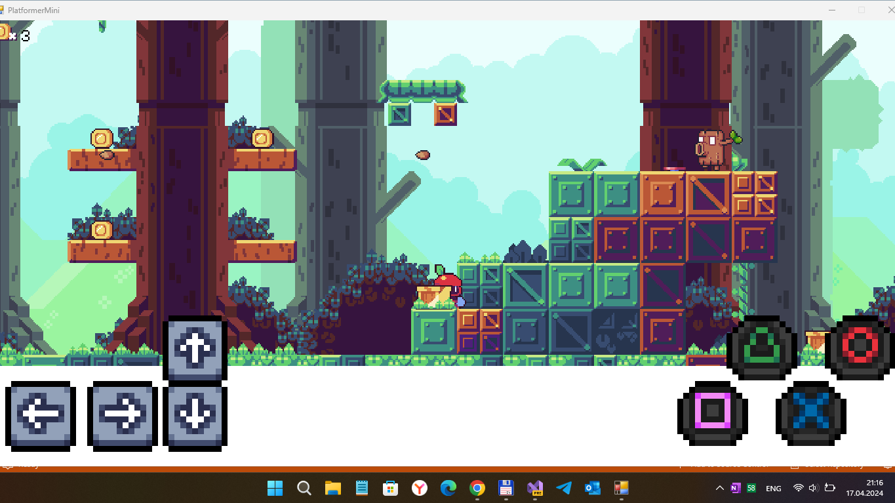

# PlatformerMini (codename)

## About

This is my fork of some interesting (but archived) small & lightweight 2D video game engine named MonolithEngine.

## Screenshot(s)

## A few word of author
"In December 2020 (5 months as of writing this), I decided to start chasing my childhood dream to become a video game developer. I started my learning curve by developing my very own 2D video game engine and I'm still working on it with enthusiasm. Since the engine is nothing without a game, I was developing a small platformer game demo to test my work and have some feedback. 
Now I've decided to make it public.
Since this game is just to test my work, the player can't die :) Also, there is no save yet because the whole game is only 2 levels and lasts about 5 minutes :)

The game will continuously receive updates as I fix bugs, polish, and add new features to the engine (particle system is up next!).

The source code together with my engine can be found on [my Github](https://github.com/Lajbert/MonolithEngine).

I hope you will enjoy it, and I'm very happy to receive any feedback as it's an important part of learning.

Assets used for the game:
https://rephil.ith.io/

https://pixelfrog-assets.itch.io

Link: https://lajbert.itch.io/platformer-demo
"

## References

https://github.com/Lajbert - Lajos Rajna aka Lajbert, the author of original MonolithEngine project

https://github.com/Lajbert/MonolithEngine - small & lightweight 2D video game engine based on Monogame

## . 
As is. No support. RnD only. DIY.

## .
[m][e] 2024