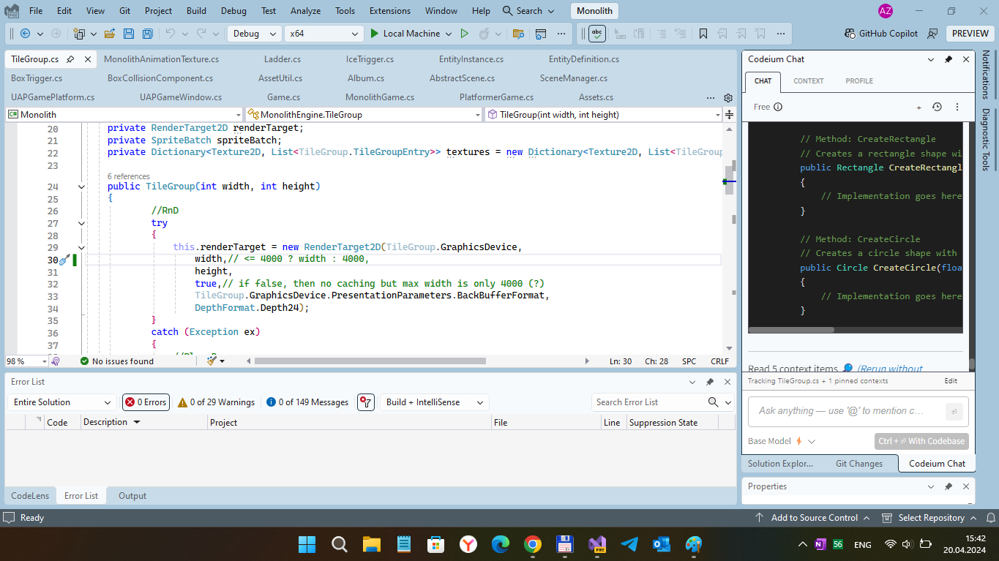

# PlatformerMini v1.0.3 - uwp branch

## About 
This is my experiment to run Monogame+MonolithEngine UWP app on/in W10M Astoria :) This is my "UWP fork" of some interesting (but archived) small & lightweight 2D video game engine named MonolithEngine.

## Tech details
- Target: Windows UWP (some mobile ui elements present for "touch ui").
- Monolith Engine tweaked (it incapsulated into Engine folder).
- Game tweaked a little too (it incapsulated into Game folder because of monolith structure)))

## Screenshot(s)

## Features / My experimentation(s)
- Min. Win. OS Build descreased to 10240 (Astoria Compatibility)
- Not tweaked Monogame 3.8 library used (it reduces project size, but so many UI stranges)
- On Lumia 950, app starts; On Lumia 640 it no operable without PC connected/debug mode :( On Lumia 640 "Astoria" project deployable but app no operable (failed on start)
- Design folder added (use it via LDtk level editor)
- Level 3 (Draft) added for my better game mechanics exploring ;)

## Requirements
This app requires Visual Studio 2017/2019/2022 Community to run. [Click here to learn how to get set up with Visual Studio](https://docs.microsoft.com/windows/uwp/get-started/get-set-up).

## Install and run the app
1. Install **MonoGame 3.8** for Visual Studio from [monogame.net](http://www.monogame.net/)
2. Clone or download this repository
3. Open **Monolith.sln** in Visual Studio.
4. To run the app, press **F5**. To quit, press **ESC**.

## Learn more about MonoGame UWP gamedev
For a step-by-step walkthrough of the code, check out the [MonoGame 2D tutorial on docs.microsoft.com](https://web.archive.org/web/20170907085024/https://docs.microsoft.com/en-us/windows/uwp/get-started/get-started-tutorial-game-mg2d).

I hope you will enjoy it, and I'm very happy to receive any feedback as it's an important part of learning.

Assets used for the game:
https://rephil.ith.io/

https://pixelfrog-assets.itch.io

Link: https://lajbert.itch.io/platformer-demo

## Known bugs
- If you decide to use PC Mode You may notice some game screen distortions. The problem that is IsMobile function always returns true... It must be fixed manually: replace true on false... and tweak SCALE_X and SCALE_Y to your own better values...  
- No game scene scaling on sersor screen. TouchPanelSwipe not coded yet.
- Level 3 (in Level select menu) has incorrected xbf files (copy of level2)
- Low gravity (Hyper-jumping). This is powered on only for game process debug symplify :)

## References

https://github.com/Lajbert - Lajos Rajna aka Lajbert, the author of original MonolithEngine project

https://github.com/Lajbert/MonolithEngine - small & lightweight 2D video game engine based on Monogame

## . 
As is. No support. RnD only. DIY.

## ..
As is. No support. For Learning purposes only. DIY

## .
[m][e] 2024
